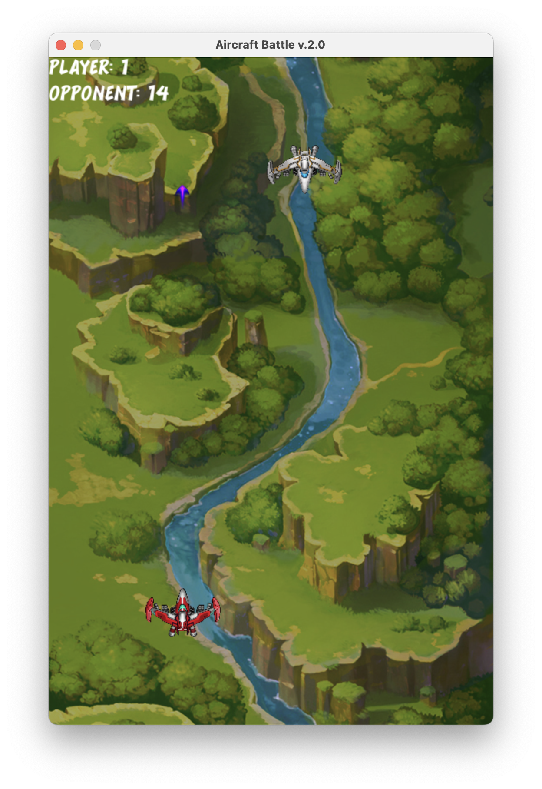
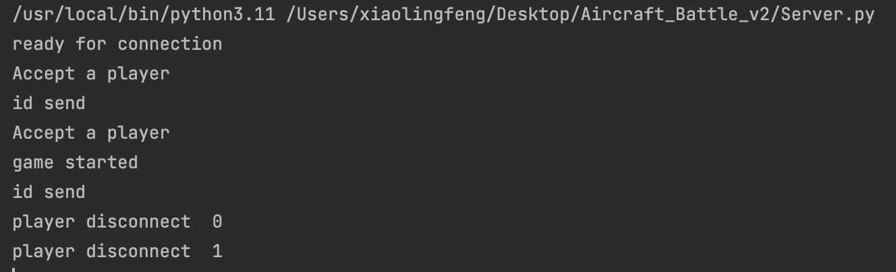

# Aircraft_Battle_Networking
A python Aircraft Battle version that supports multi-player remote interplay
Use Internet programming so that the client can connect to the third server and match the battles against each other.

# UI Presentation

client

server

